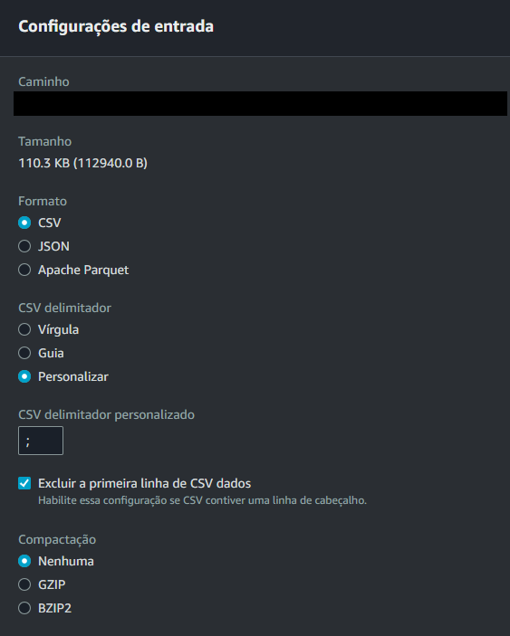
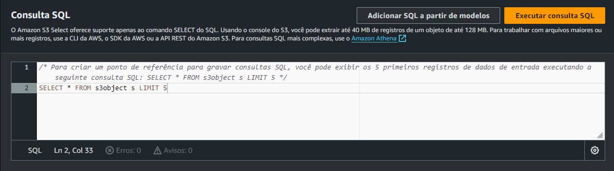
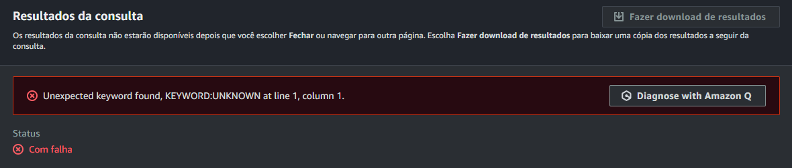
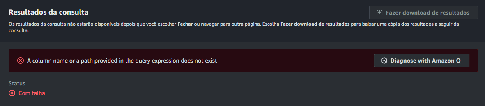

# S3 Select e possíveis problemas (Referência SQL)

**⚠️Importante!**
Antes de começar a destrinchar este documento, tente dar uma lida na documentação na íntegra. Você pode encontrá-la aqui: [AWS Selecting Content From Objects](https://docs.aws.amazon.com/pt_br/AmazonS3/latest/userguide/selecting-content-from-objects.html). Caso você queira uma lista dos ***códigos de erros*** do `select object content`, eles estão aqui: [AWS List of SELECT Object Content Error Codes](https://docs.aws.amazon.com/pt_br/AmazonS3/latest/API/ErrorResponses.html#SelectObjectContentErrorCodeList).

## Alguns "problemas" ou dificuldades que eu encontrei tentando executar as queries em um arquivo .csv

Obs.: Eu não testei em arquivos `.json` ou `Apache Parquet`

Vou mostrar alguns "problemas" que encontrei tentando executar queries, que podem ajudar você a não gastar tanto tempo, pelo menos, nesses pontos.

### Configuração de entrada

Preste atenção na hora de configurar a **entrada**:

1. Escolha o formato correto, igual o seu arquivo que está no bucket.

2. Cuidado com o delimitador! Caso seja um arquivo **.csv**, preste atenção se o delimitador não é algo diferente do padrão `vírgula`.

3. "Excluir a primeira linha de CSV dados" - Não esqueça de habilitar esta caixa caso o seu arquivo .csv tenha uma linha de cabeçalho.
*Isso atrapalha quando utilizar/testar **Funções Condicionais***



Eu sei que é algo bem *intuitivo* e *simples*, mas prestar atenção nisso pode ajudar a evitar dores de cabeça. 😉

### Consultas SQL

Você pode ficar tentado a fazer uma consulta super completa e complexa logo de cara, mas **CALMA LÁ**!



Você clica em `Executar consulta SQL` e o resultado se mostra lindo na sua tela! UFA! Então você começa a escrever sua consulta, talvez algo simples no início, e com o tempo vai deixando cada vez mais complexa. Você escreve algo por conta própria para ir modelando o que gostaria que fosse o resultado final, então escreve algo assim: **(exemplo)**.

```SQL
SELECT * 
FROM s3object
WHERE <Condição>
LIMIT 5
```

Então você se deparada com o **seguinte erro:**



E agora? Onde é o problema? O que será que tem de errado nessa consulta tão simples? 🤔 (Sério, fiquei um tempo nisso, talvez eu seja meio ~~burro~~ ou ~lento~ 🐌)
Vamos ao que interessa...

* A solução: **Não indente as consultas - deixa tudo em linha mesmo! (Até no seu código em Python com *Boto3*)**

```SQL
SELECT * FROM s3object WHERE <Condição> LIMIT 5
```

**~~Isto está na documentação, em algum lugar.~~** 😑

#### ORDER BY, HAVING, GROUP BY - Aparentemente **NÃO** funcionam! Eu tentei, mas não obtive sucesso

***Obs:*** `*ORDER BY*` está na documentação dizendo que não funciona.

### Função de Conversão

* CAST

Caso você não deixe explícito o tipo de dado, o S3 Select tratará todos os dados de entrada como string.
**Exemplo:**

```SQL
SELECT SUM(CAST(<NameColumn> AS DECIMAL)) FROM s3object LIMIT 10
```

```SQL
SELECT <NameColumn> FROM s3object WHERE CAST(<NameColumn> AS DECIMAL) > 500
```

O que eu fiz? Por garantia, usei `CAST` para explicitar os valores.

### Funções Agregadas

* AVG( expression )
* COUNT
* MAX( expression )
* MIN( expression )
* SUM( expression )

Por algum motivo, você consegue fazer consultas com mais de uma **Função Agregada**, mas se tentar usar qualquer outra função junto, um erro aparece:




Mesmo você sabendo que o problema não está no `nome da coluna` ou qualquer outra coisa em relação ao seu arquivo.

### O que faço se não consigo usar as funções no SELECT command?


Beleza, preciso usar `funções de agregação`, `função condicional`, `de conversão`, `função de data`, `função de String`, mas o ~~maldito~~ **SELECT command** não funciona com todas elas como estou acostumando a fazer nas minhas consultas SQL, O QUE EU FAÇO??

**Utilize na cláusula *WHERE*!**

Vou usar como exemplo como eu fiz:

***NÃO FUNCIONA*** ⬇️

* Indentação tá zoando a parada.
* SELECT command está zoado por causa das funções todas juntas.
* Os `Alias`: "AS [talcoisa]" não ajudam, eles não aparecem no output. (Não faço ideia do porquê, só deixei pra lá).

```SQL
SELECT SUM(CAST(Vinculados AS DECIMAL)) AS TotalVinculados,
    AVG(CAST(Evadidos AS DECIMAL)) AS MediaEvadidos,
    COALESCE(CAST(Ano AS DECIMAL), 2010) AS AnoConvertido,
    TO_STRING(TO_TIMESTAMP(CAST(Ano AS STRING), 'yyyy')) AS AnoFormatado,
    UPPER(NomeCurso) AS NomeCursoMaiusculo
FROM s3object
WHERE CAST(Vinculados AS DECIMAL) > 500 
  AND CAST(Evadidos AS DECIMAL) < 100
LIMIT 10
```

***FUNCIONOU*** ⬇️

⚠️VOU DEIXAR FORMATADO, MAS NÃO FUNCIONA SE ESTIVER FORMATADO! Só pra ficar melhor visualizar.

```SQL
SELECT SUM(CAST(Vinculados AS DECIMAL)), 
    AVG(CAST(Evadidos AS DECIMAL)) 
FROM s3object 
WHERE CAST(Vinculados AS DECIMAL) > 500 AND CAST(Evadidos AS DECIMAL) < 100 
AND TO_TIMESTAMP(COALESCE(CAST(Ano AS STRING), '2009') || '-01-01 00:00:00', 'yyyy-MM-dd HH:mm:ss') > TO_TIMESTAMP('2012-01-01 00:00:00', 'yyyy-MM-dd HH:mm:ss') 
AND LOWER(NomeCurso) != 'administração' LIMIT 10
```

### Considerações finais

Espero ter ajudado de alguma forma, pelo menos para não perder tempo com algo que depois você pense "caramba, eu sou um besta", como aconteceu comigo! Ou que tenha sido de ajuda como um pontapé inicial.
Caso você tenha algo para complementar, corrigir, com outras situações, qualquer coisa, é **SUPER bem-vindo!**

Lembrando que sobre **informação/conhecimento**, ***NOSSO*** é sempre melhor do que apenas **meu**.


